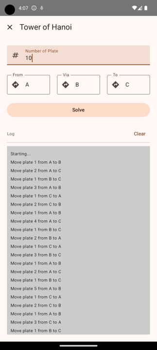

# 2nd Month Homework

## Tower of Hanoi
> Implement Tower of Hanoi algorithm.

### Guidelines
- Download this base code and modify solA() function to solve the Tower of Hanoi.

## Introduction
The Tower of Hanoi is a classic problem in computer science and mathematics that involves three rods and a number of disks of different sizes. The objective is to move all the disks from one rod (source) to another rod (destination), using a third rod (auxiliary) as an intermediary, while following these rules:

1. Only one disk can be moved at a time.
2. A disk can only be placed on top of a larger disk or on an empty rod.

## Purpose
This assignment aims to implement the Tower of Hanoi solution using a recursive algorithm. The Tower of Hanoi problem is an excellent way to understand recursion, a powerful concept in computer science where a function calls itself to solve smaller instances of the same problem.

## Learning Objectives
- Understand the principles of recursion.
- Learn how to break down complex problems into simpler sub-problems.
- Gain insights into the efficiency and limitations of recursive algorithms.

## Implementation
The implementation involves writing a recursive function in Kotlin that performs the necessary steps to move the disks according to the rules of the Tower of Hanoi. The program will print the steps to the console, providing a log of each move made during the process.